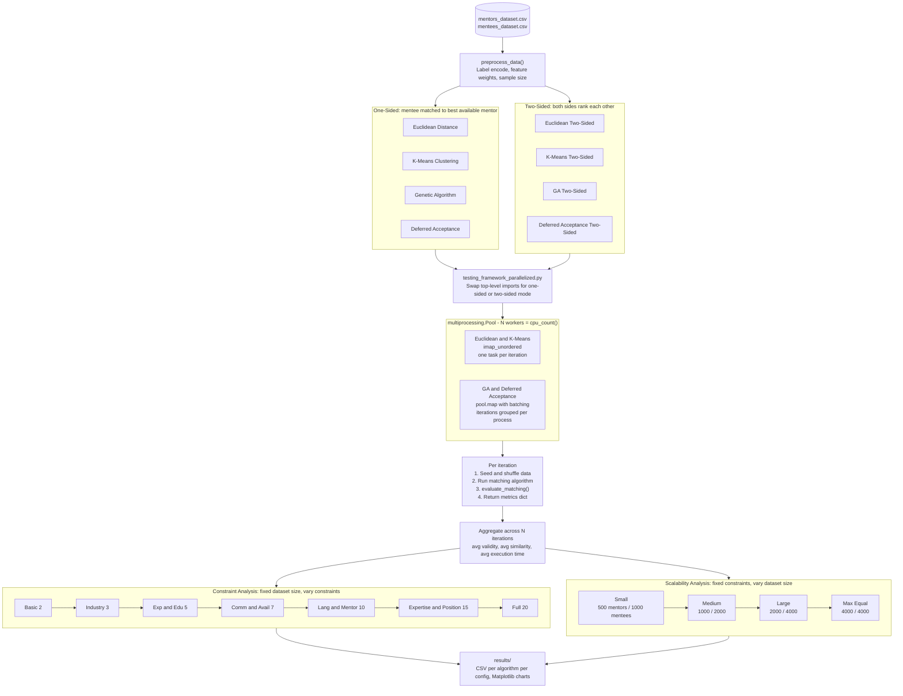

# Mentor-Mentee Matching Algorithms — FYP

A comparison of four mentor-mentee matching algorithms, each implemented in both a **one-sided** and **two-sided** variant, evaluated across varying constraint levels and dataset sizes using a parallelised testing framework.

---

## Architecture



---

## Algorithms

Each algorithm implements three functions: `preprocess_data()`, a matching function, and `evaluate_matching()`.

| File | Algorithm | Type |
|---|---|---|
| `euclideanalgorithm.py` | Euclidean Distance | One-Sided |
| `kclusteringalgorithm.py` | K-Means Clustering | One-Sided |
| `genetic_algorithm.py` | Genetic Algorithm | One-Sided |
| `DefferedAcceptance_algorithm.py` | Deferred Acceptance (Gale-Shapley) | One-Sided |
| `eucledeanalgorithm_twosided.py` | Euclidean Distance | Two-Sided |
| `kclusteringalgorithm_twosided.py` | K-Means Clustering | Two-Sided |
| `genetic_algorithm_twosided.py` | Genetic Algorithm | Two-Sided |
| `DefferedAcceptance_algorithm_twosided.py` | Deferred Acceptance | Two-Sided |

**One-sided**: the mentee is matched to their highest-scoring available mentor.  
**Two-sided**: both mentors and mentees express ranked preferences; matches are stable when neither party would prefer to switch.

---

## Testing Framework

### `testing_framework_parallelized.py` — One-Sided Mode
Runs Euclidean, K-Means, GA, and Deferred Acceptance against each constraint and dataset-size configuration. Uses `multiprocessing.Pool` for parallelism:
- Euclidean / K-Means: one task per iteration (`imap_unordered`)
- GA / Deferred Acceptance: iterations batched per process (`pool.map`) to reduce spawn overhead

### `collab_testing_framework.py` — Two-Sided / Colab Mode
Identical structure but runs the two-sided algorithm variants. Includes a Google Colab compatibility block in `main()`.

### Supporting Scripts
| File | Purpose |
|---|---|
| `single_algorithm_runner.py` | Run one algorithm with specific parameters; outputs a `.pkl` for later merging |
| `results_merger.py` | Merge `.pkl` files from distributed runs into a single results CSV |
| `distribute_runs.sh` | Generate shell commands to distribute iterations across terminals/machines |

---

## Evaluation Metrics

Each run records per iteration:
- **Validity %** — proportion of matches sharing ≥ 2 features
- **Avg Similarity Score** — mean normalised Euclidean similarity (0–100%)
- **Execution Time** — wall-clock time per iteration

Averages are computed across all randomised iterations.

---

## Constraints Tested

Constraints are layered cumulatively from 2 up to 20:

| Level | Constraints Added |
|---|---|
| Basic (2) | Max mentees per mentor, min shared features |
| Industry (3) | + Industry match |
| Experience & Education (5) | + Min experience gap, education level |
| Communication & Availability (7) | + Communication method, availability |
| Language & Mentoring (10) | + Primary/secondary language, mentoring preference |
| Expertise & Position (15) | + Expertise overlap, position progression, complementary roles |
| Full (20) | + Gender, location, workstyle, industry years, mentoring style |

---

## Setup

### Using pip
```bash
pip install -r requirements.txt
```

### Using Conda
```bash
conda env create -f CONDA_ENVIRONMENT.yml
conda activate <env-name>
```

---

## Usage

### Run full evaluation (one-sided algorithms)
```bash
python testing_framework_parallelized.py
```

### Run full evaluation (two-sided algorithms)
```bash
python collab_testing_framework.py
```

### CLI options
```bash
python testing_framework_parallelized.py --constraints-only
python testing_framework_parallelized.py --scalability-only
python testing_framework_parallelized.py --quick-test
python testing_framework_parallelized.py --processes 4
```

### Run a single algorithm
```bash
python single_algorithm_runner.py --algorithm Euclidean --iterations 100 --mentor-size 500 --mentee-size 1000
```

---

## Dataset

The included CSV files (`mentors_dataset.csv`, `mentees_dataset.csv`) are **synthetically generated** and contain no real personal data. Each profile includes: position, experience level, expertise, language, industry, education, availability, location, and mentoring preferences.

---

## Files to Ignore

Results, processed data, and screenshots are excluded via `.gitignore` as they are reproducible by running the framework.
